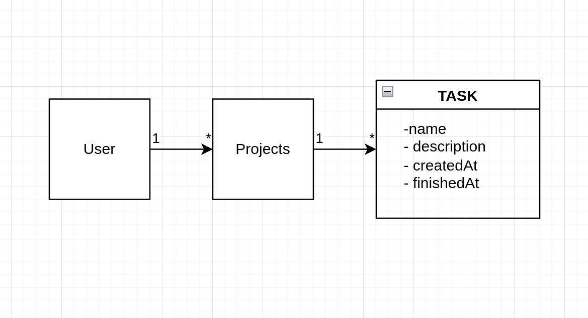

## Developer Test

This repository contains the source code of the Full stack developer selection process at Bolttech.io.

## How to run

### Frontend
To run this project you should open two terminals or consoles. You should open the forlder `frontend` in the first one and open the folder `backend` in the second one.

In the terminal that you have the `frontend` oppend you shoul run the command:
```
npm run dev
```
or
```
yarn dev
```

It will run the project as development mode. To run as production mode you should replace `dev` in the command for `start` word.


### Backend

To run the backend in the development mode you should run the command:
```
NODE_ENV=dev npm run dev
```

It will create an `dev-db` a development database in the mongo atlas at the database URL in the `.env` file can show you.

To run as production you should replace the commando to:
```
NODE_ENV=PROD npm run start
```

**The backend runs in the 3333 PORT by default**.


## Test

The project has some tests in the backend side. The tests uses a jest library that you can find in https://jestjs.io.

To run the test you can use two commands. The first one run the test once:
```
npm test
```

The second one run the test every time does a file change:
```
npm run test:watch
```

## Database

This project uses the **Mongo DB** as database. You can access him using the **Mongo compass** tool, just refer the `.env` file and use the `MONGO_URL` strin value to connect to the cluster.


You will see two databases, the first one is the `prod-db` and is the production database. The second one is the `dev-db` and it is the development database. And the last one is the `test` where our backend make CRUD tests.

## Implemetation Details

- The project is divide in two main folders, the frontend and backend, wich communicates between http calls.
- The backend was created using Node.js and Express.js.
- The frontend was created using Next.js, an React.js framework.


### Architecture

The diagram below shows the basic architecture of the project.

This is the basic realationship between the entities.
